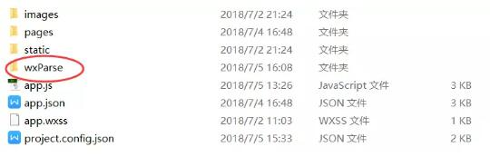

## wxParse官方下载地址：https://github.com/icindy/wxParse

最近在做一个微信小程序项，遇到了文章的详情页面是富文本的情况，内容是通过接口读取的服务器中的富文本内容，是html格式的，小程序默认是不支持html格式的内容显示的，那我们需要显示html内容的时候，就可以通过wxParse来实现。
或微信组件rich-text

### 使用方法：

**一，下载完之后我们需要用到此目录下的wxParse文件夹，把他拷贝到我们小程序项目的根目录下：**


**二，配置文件**

首先在xx.wxml导入文件，在文件头写上：

<import src="../../wxParse/wxParse.wxml"/>

然后再wxss导入文件，在文件头写上：

@import "../../wxParse/wxParse.wxss";

**三，在页面xx.js里的onLoad()方法里面写上：**

var WxParse = require('../../wxParse/wxParse.js');

WxParse.wxParse('content', 'html', content, that,5)
 
此方法的含义为：

```
var article = '<div>我是HTML代码</div>';/**
* WxParse.wxParse(bindName , type, data, target,imagePadding)
* 1.bindName绑定的数据名(必填)
* 2.type可以为html或者md(必填)
* 3.data为传入的具体数据(必填)
* 4.target为Page对象,一般为this(必填)
* 5.imagePadding为当图片自适应是左右的单一padding(默认为0,可选)
*/var that = this;
WxParse.wxParse('article', 'html', article, that, 5);


Page({
  data: {
  },
  onLoad: function () {
    var that = this;
    wx.request({
        url: '', 
        method: 'POST',
        data: {
            'id':13
        },
        header: {
            'content-type': 'application/json'
        },
        success: function(res) {
            var article = res.data[0].post;
            WxParse.wxParse('article', 'html', article, that,5);
        }
    })
  }
})


```

四，在页面中引用模板
```
<import src="../../wxParse/wxParse.wxml"/>
<template is="wxParse" data="{{wxParseData:article.nodes}}"/>//这里data中article为bindName
```
这样就可以在微信小程序中嵌入html内容啦~


### 问题解决

腾讯的开发工具上使用无问题，但是在预览在手机上或者小程序发布之后却不能显示富文本了，调试模式下后台也没有发现报错。

排查后发现程序运载到插件的html2json.js文件中第112行时，就没有在往下走了：

```
console.dir(value);
```

可能是console.dir()方法在微信无法支持，将其注释掉或者改为console.log()方法，问题解决。


